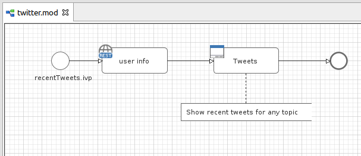
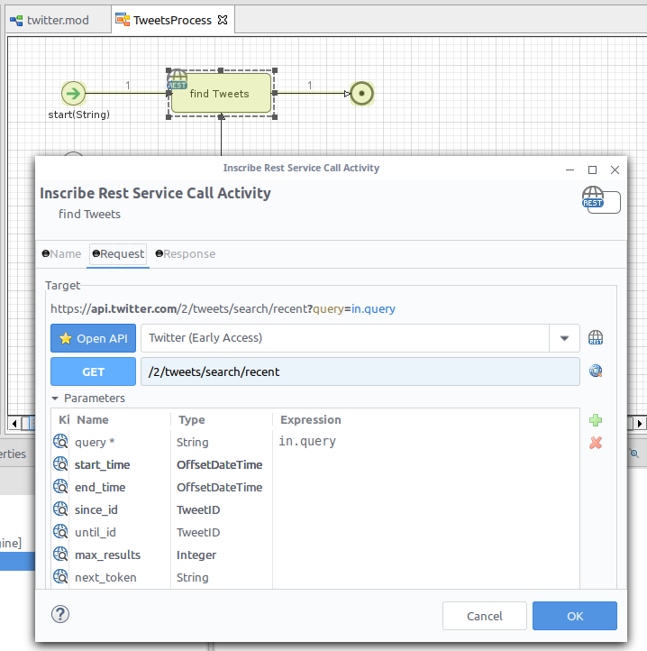
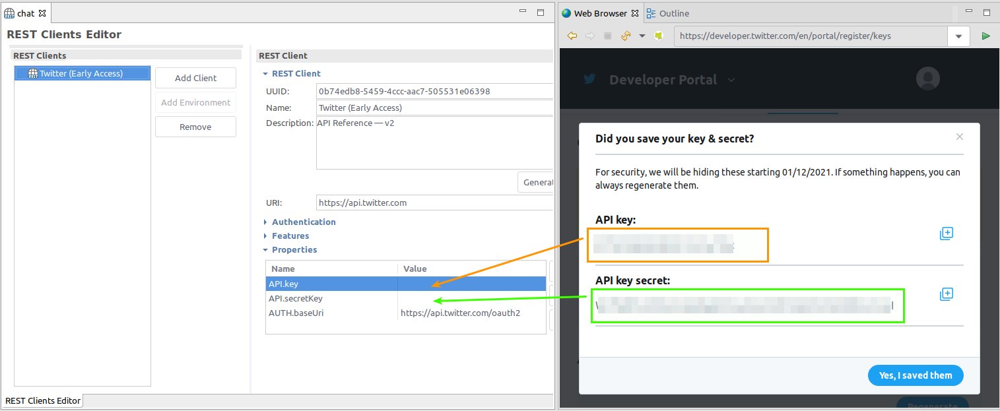

# X Connector
Axon Ivy’s [X (formarly Twitter)](https://twitter.com/) connector illustrates the power of
integrating existing systems to your process automation initiatives. Social
communication is a must and using X (formarly Twitter) in any business process supports an
open communication strategy. See what's happening in the world right now! This
connector:

- Gives you full power to the OpenAPI X (formarly Twitter) services.
- Supports you with an easy-to-copy demo implementation to reduce your
  integration effort.

## Demo

1. Shows how to read recent tweets with a keyword.

## Setup

1. Get a X (formarly Twitter) account and sign up for a developer account too.
https://developer.twitter.com/en/docs/authentication/oauth-2-0/bearer-tokens
2. Create an application with your developer account.

3. Copy `API.key` and `API.secretKey` into your Rest Client Properties.

