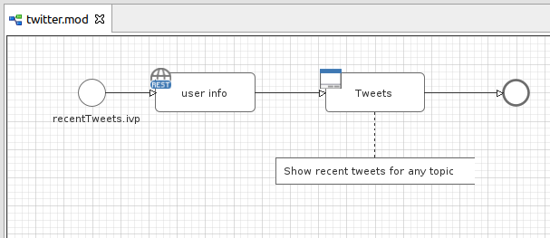
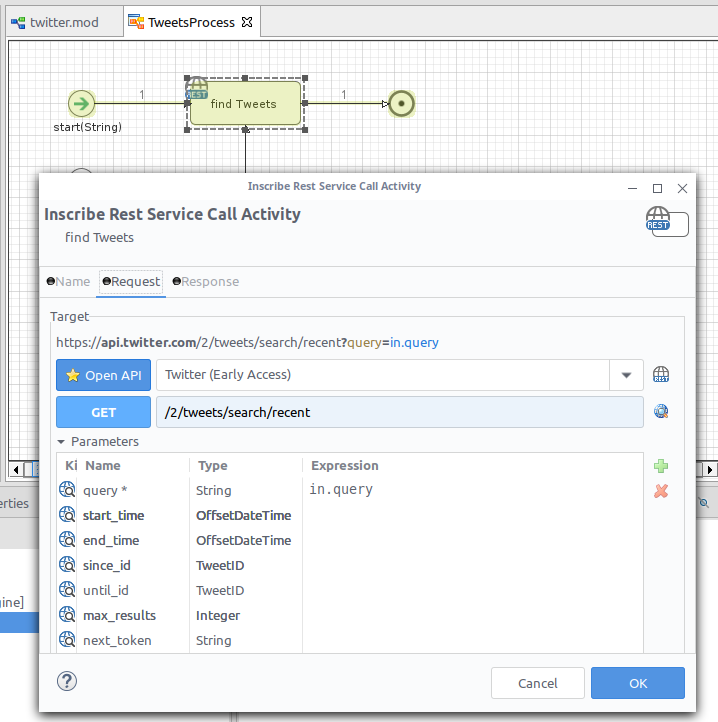
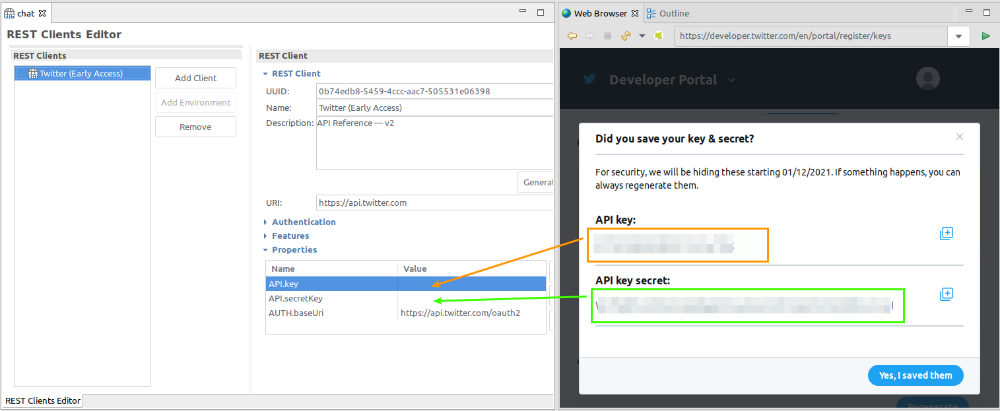

# X-Konnektor
Der [X](https://twitter.com/)-Konnektor von Axon Ivy verdeutlicht die
Leistungsfähigkeit der Integration bestehender Systeme in Ihre
Prozessautomatisierungsinitiativen. Soziale Kommunikation ist ein Muss, und die
Verwendung von X in jedem Geschäftsprozess unterstützt eine offene
Kommunikationsstrategie. Dieser Konnektor:

- Damit haben Sie vollen Zugriff auf die OpenAPI X-Dienste.
- Unterstützt Sie mit einer Demo-Implementierung.

## Demo

1. Zeigt, wie man aktuelle Tweets mit einem Stichwort liest.





## Einrichtung

1. Erstellen Sie einen X-Account (ehemals Twitter) und registrieren Sie sich
   auch für einen Entwickler-Account.
   https://developer.twitter.com/en/docs/authentication/oauth-2-0/bearer-tokens
2. Erstellen Sie eine Anwendung mit Ihrem Entwicklerkonto.
   
3. Kopieren Sie `API.key` und `API.secretKey` in Ihre Rest Client-Eigenschaften.
   

Fügen Sie die folgenden Variablen „ `“` zu Ihren Variablen „ `“ variables.yaml`
hinzu:

```
@variables.yaml@
```

Ersetzen Sie die Werte durch Ihre angegebenen Einstellungen.

> [!HINWEIS] Der variable Pfad `X-Connector` wird ab Version 13 in `XConnector`
> umbenannt.
